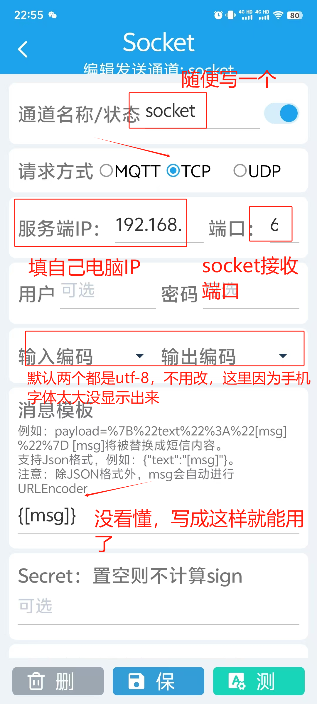

# 实现短信验证码自动在PC端同步

## 效果展示


## 实现步骤

### 1.安装短信转发器SmsForwarder

在安卓手机上安装短信转发器SmsForwarder
https://github.com/pppscn/SmsForwarder

### 2.SmsForwarder配置
注意！一般手机都默认开启了验证码安全保护，需要在设置里面搜索验证码进行关闭。
基础配置参考官方wiki
https://gitee.com/pp/SmsForwarder/wikis/pages

**pushplus配置参考**
https://www.amjun.com/485.html
https://www.youtube.com/watch?v=Bkt6QpkoVfw&t=272s


### 3.Socket配置

**A.发送通道配置如下**

端口写65432，程序中socket接收端口设置为了65432




**B.将代码clone到本地部署运行**

```bash
```

